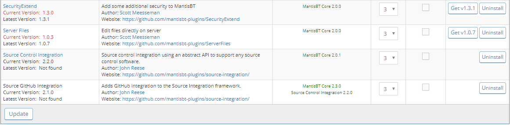
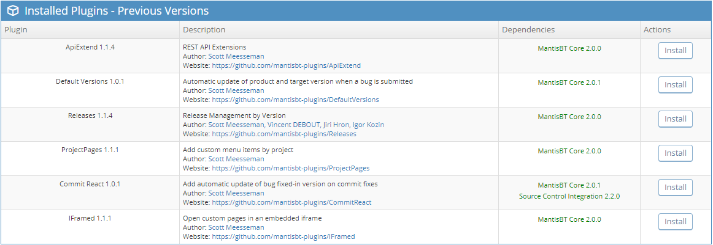

# PluginManagement MantisBT Plugin

- [PluginManagement MantisBT Plugin](#PluginManagement-MantisBT-Plugin)
  - [Description](#Description)
  - [Installation](#Installation)
  - [Requirements](#Requirements)
  - [Issues and Feature Requests](#Issues-and-Feature-Requests)
  - [Configuration](#Configuration)
  - [Usage](#Usage)
  - [Screenshots](#Screenshots)
  - [Todos](#Todos)

## Description

This plugin adds the ability to:

1. Check for new plugin versions
2. Download/install new plugin versions
3. Backup/restore previously installed plugin versions

## Installation

Extract the release archive to the MantisBT installations plugins folder:

    cd /var/www/mantisbt/plugins
    wget -O PluginManagement.zip https://github.com/mantisbt-plugins/PluginManagement/releases/download/v1.0.0/PluginManagement.zip
    unzip PluginManagement.zip
    rm -f PluginManagement.zip

Ensure to use the latest released version number in the download url:  (version badge available via the [ApiExtend Plugin](https://github.com/mantisbt-plugins/ApiExtend))

Install the plugin using the default installation procedure for a MantisBT plugin in `Manage -> PluginManagement`.

## Requirements

The following PHP components are required by this plugin:

- php-zip

    sudo apt install php7.2-zip
- webserver must have write access to each individual plugin directory in order to update them, including this plugin directory

## Issues and Feature Requests

Issues and requests should be submitted on my [MantisBT](https://app1.spmeesseman.com/projects/set_project.php?project=PluginManagement&make_default=no&ref=bug_report_page.php) site.

## Configuration

You can set access rights for viewing and/or editing the PluginManagement options in the MantisBT plugin settings.  The default access rights are:

- View Access => MANAGER
- Edit Access => ADMINISTRATOR

This plugin uses the GitHub API for checking current versions and downloading releases from the [mantisbt-plugins](https://github.com/mantisbt-plugins/) org.  The number of unauthenticated API calls is very limited, if you find that the API is exhausted when viewing the main screen, consider [creating an API token](https://github.com/settings/tokens) and saving it in the PluginManagement options in the MantisBT plugin settings.  This is optional, but you will no loger experience the API limit exhaustion.

## Usage

TODO

## Screenshots

## Todos

- [ ] make all default actions work uninstall/install/etc
- [ ] Check for available plugins that are not installed
